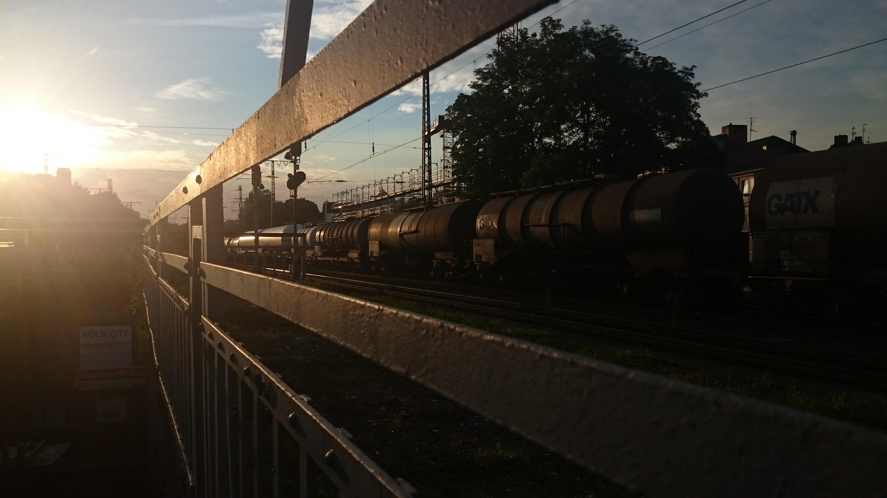
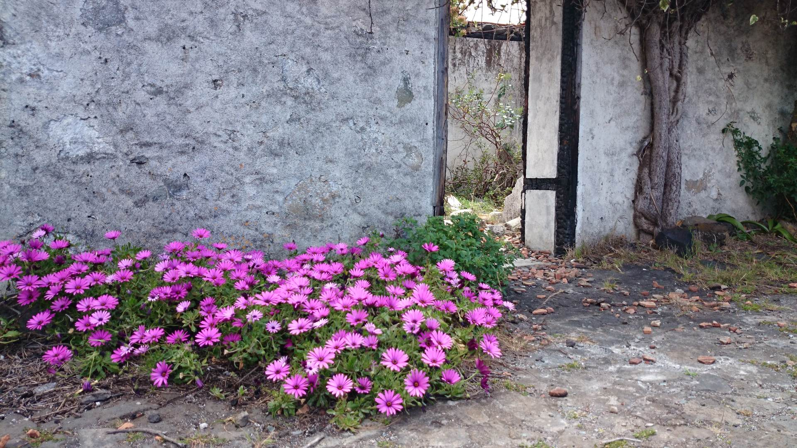
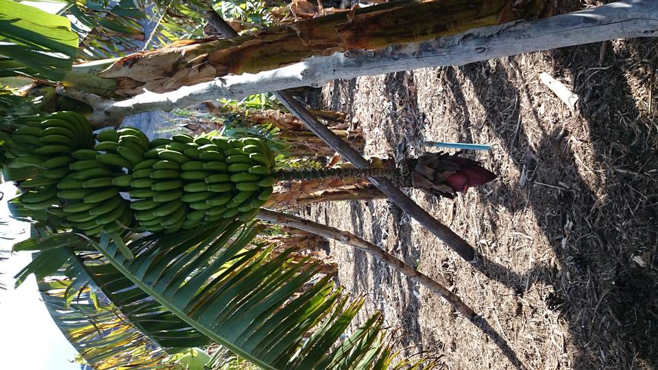
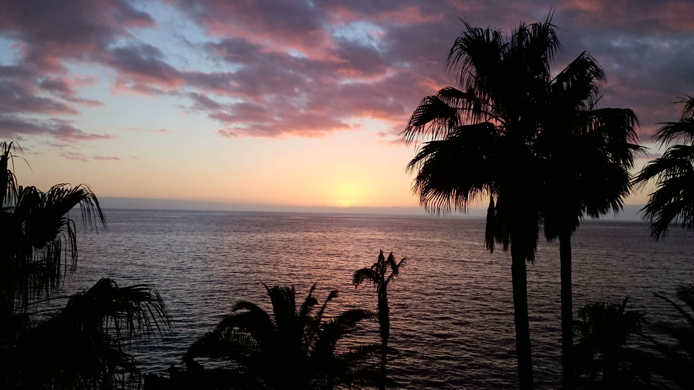

Lately I quit my old job at a publishing house in Dortmund, waited out the 3 months period of notice and then went on a short holiday to [La Palma](https://www.google.de/maps/place/La+Palma,+Santa+Cruz+de+Tenerife,+Spain/@28.6551728,-17.8657039,11z/data=!3m1!4b1!4m2!3m1!1s0xc6bf20c6a87a13b:0x8e2037d22330882d) (one of the Canary islands) last week, where I saw clouds drifting over a volcanic mountain range, hiked through pyroclastic lava fields and primeval forests, got a baseball cap and a nicely tanned fat tummy from eating lots of bananas. (Still no beard.)

Then this week I started my new job at a large publishing house in my former home town Cologne (about 90 minutes away). For the next few months I'll be living in two cities, on the weekends and working days. The new job is turning out to be extremely interesting as I'll be working with some new tools I hadn't had the chance to use before (git among them) and a really nice bunch of people. I think I'll kinda miss working in the midst of the city hustle, but most of all I'll miss my wife and cat during the week. Still I'm extremely happy about this change and I'm looking forward to move all of us back to Cologne eventually.

More banana trivia, whoo! A complete banana cluster weighs between 35 to 50 kilograms (80 and 110 pounds). On La Palma there are no machines to harvest them so they are harvested by hand. Bananas on La Palma are slightly smaller and taste sweeter and more aromatic than the ones I can get in German supermarkets. Bananas are not trees but actually huge herbs! They die off after bearing their fruits, but 2 or 3 new sprouts come from the same root ball and repeat the cycle. Additionally they produce seeds. I have two banana plants in my room, that I've grown from seeds.  