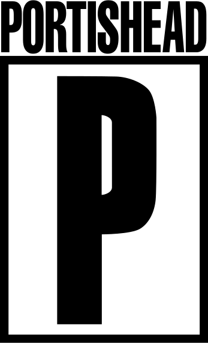
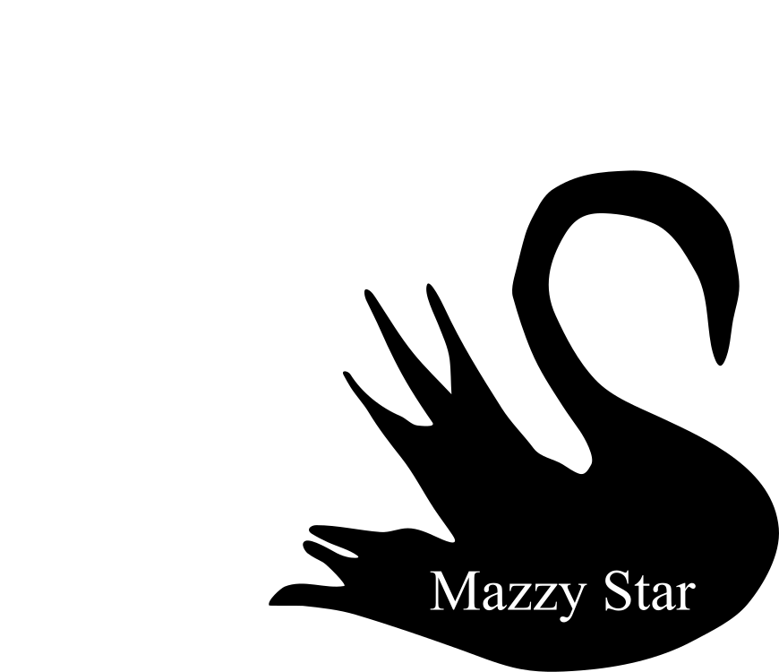
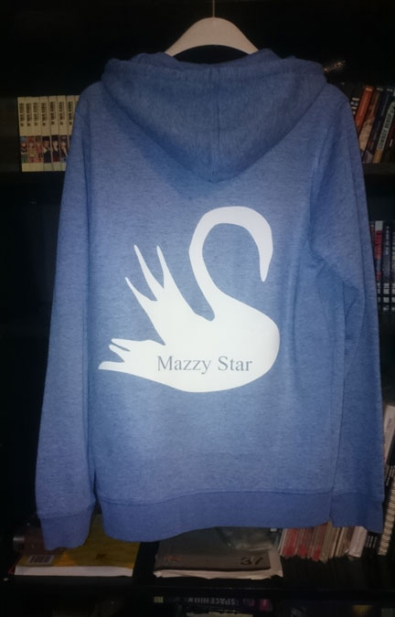
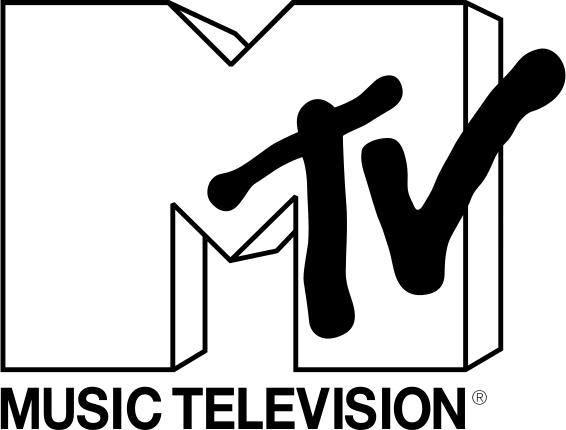

### Portishead
> The mask that the monsters wear to feed upon their prey

I found a [font](https://www.dafont.com/portishead-dummy.font) for the name but had to tweak it and recreate the large P.

### Mazzy Star
> Look on down from the bridge

Traced and modelled from the Mazzy Star album cover for [Among my Swan](https://www.google.com/search?&tbm=isch&q=mazzy%20star%20among%20my%20swan).
As I found out the font they used is a simple Times New Roman. I actually printed this one on an old sweater.

### MTV

> I want my MTV

This can found at various places on the net. I merely cleaned it up a bit, removing background colors and consolidating the paths.

### Ideal
> Ich bin ein roter Spiegel an einem roten Karussell

I took the logo from a [single](http://streamd.hitparade.ch/cdimages/ideal-berlin_s.jpg) and traced and remodelled Anette Humpe after various Youtube [screenshots](https://i.ytimg.com/vi/56a_WEUhqIw/maxresdefault.jpg) of a live concert.

