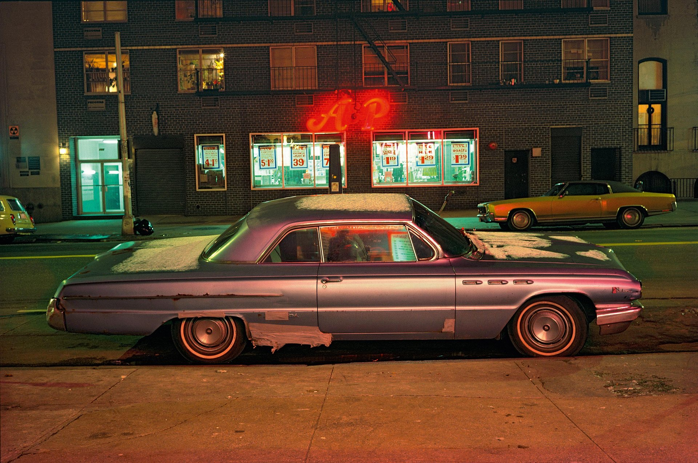
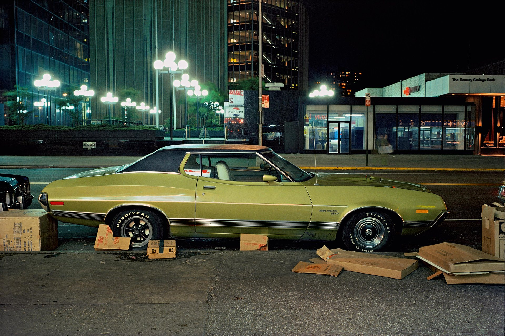
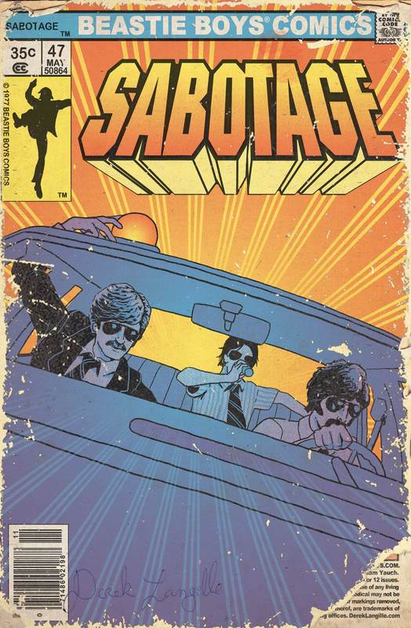
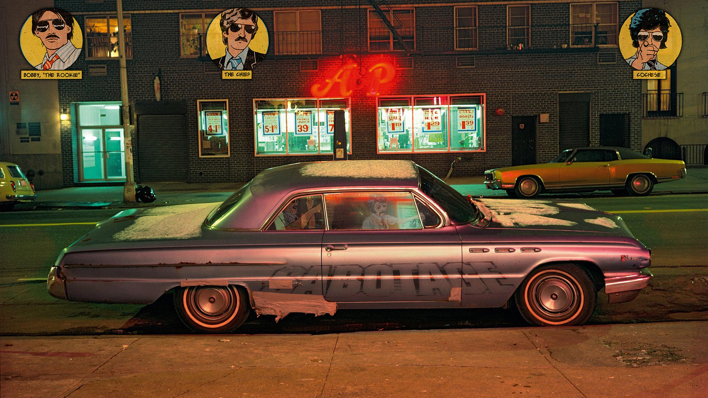

NYC cars 1974-1976 by [Langdon Clay](http://www.langdonclay.com)

- [http://www.newyorker.com/culture/photo-booth/when-cars-ruled-the-night-new-york-city-1974-1976](http://www.newyorker.com/culture/photo-booth/when-cars-ruled-the-night-new-york-city-1974-1976)
- [https://www.theguardian.com/culture/gallery/2016/dec/03/portraits-new-york-city-cars-langdon-clay](https://www.theguardian.com/culture/gallery/2016/dec/03/portraits-new-york-city-cars-langdon-clay)

A&P car, Buick LeSabre, 14th Street between 7th and 8th Avenues, 1974

Box car, Gran Torino Sport, in the Twenties or Thirties on the East side, 1975

---

[Beastie Boys Sabotage tribute comic](http://dereklangille.blogspot.de/2012/06/for-adam.html) by Derek Langville

---

Putting it all together:

